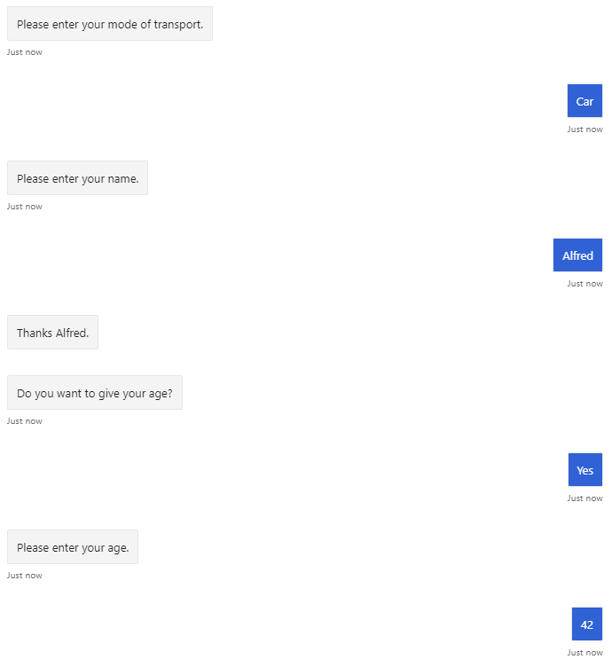
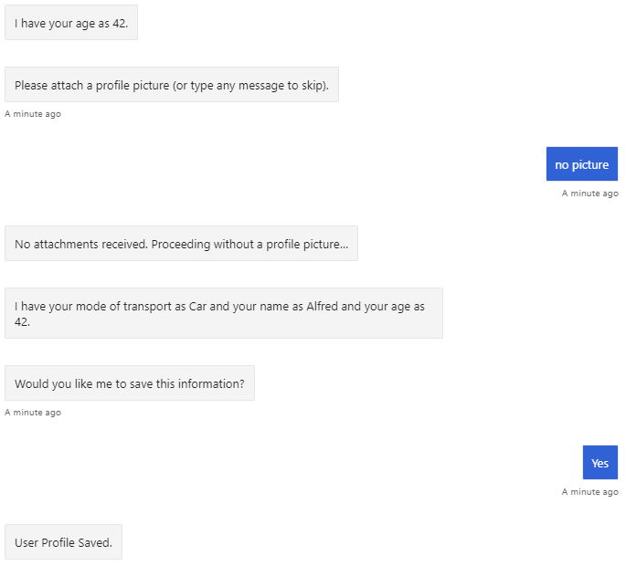
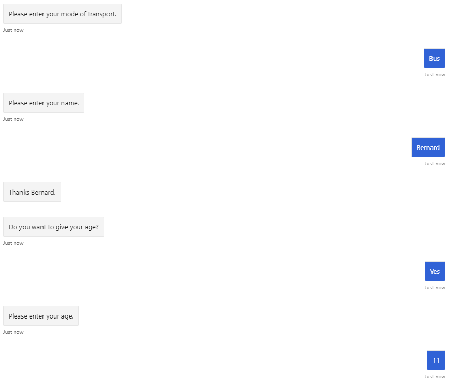
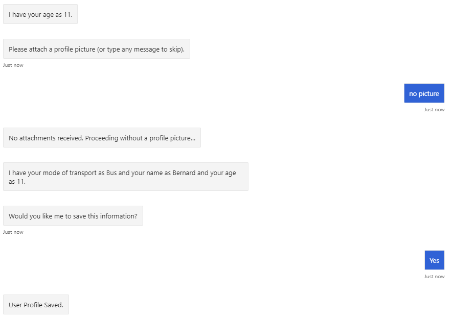

# Tests Demonstrating Common Mistakes

This sample provides a few tests that show why improperly stored state can cause issues. These issues can often be difficult to catch when testing in a development environment simply because they need to be tested with concurrent users and each user may need to be at very specific steps in the dialog in order to cause issues.

## Running the Tests

There are two sets of tests included in this:

1. Testing [userProfileDialogNormal](../dialogs/userProfileDialogNormal.js), [userProfileDialogGlobal](../dialogs/userProfileDialogGlobal.js), and [userProfileDialogProperty](../dialogs/userProfileDialogProperty.js):
   1. From the root of the sample, type `npm run test`.
   2. As the test runs, the console will output a brief description of what each test is doing.
   3. Read the comments in [dialogTests](./dialogTests.test.js) and [userProfileTest](./userProfileTest.js) for more information.
2. Test your own dialogs for user state issues.
   1. Finish all of the `TODO:` items in [testYourDialog](./testYourDialog.test.js) to test your own dialog against multiple, concurrent users.
      1. Adding your dialog: Edit the `require` statement to import your dialog.
      2. Create users for your dialog by editing the `USERS` variable. You may use the existing users or add your own. Ensure there is one `bot` and at least two non-bot users.
      3. Create a "transcript" for your user conversations (see below). For best results:
         1. Each user must initiate the conversation with the bot. The text used is irrelevant.
         2. The bot's reply must directly follow each user's message.
         3. Ensure multiple users interact with the bot at the same time at various stages of the dialog (as shown in the example transcript).

### Creating the Transcript

The transcript shown in the `activities` variable of [testYourDialog](./testYourDialog.test.js) was generated by speaking with the bot in Emulator with two different users, recording the messages, then merging the conversations from each user into the `activities` variable. Here's what the conversations look like in Emulator:

**Alfred**:

**Bernard**:

